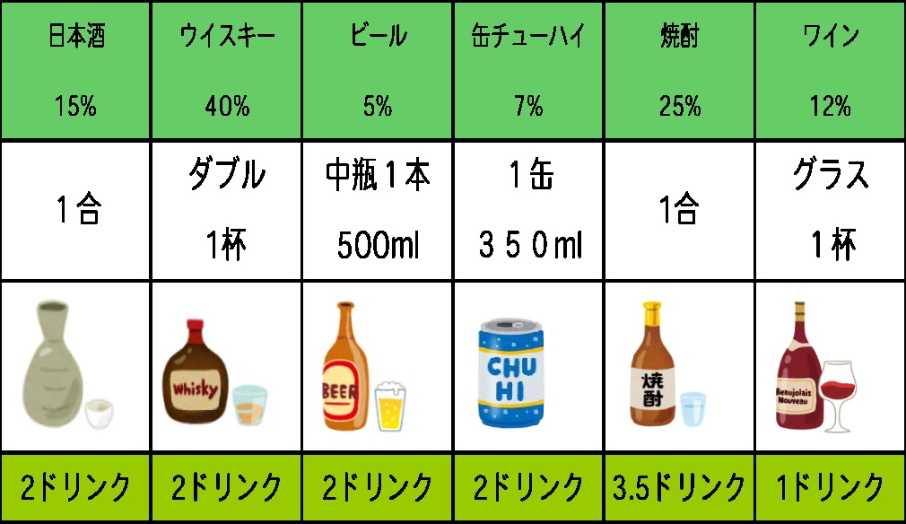

# 生活習慣の記録様式

### 注意点
* 生活習慣のデータを確定させるため、「今日何時に起きたか」以外の質問は1日前のことについて質問する。  
そのため、ロボットに登録する場合、例えば6日前のデータを登録するとき「7日前...」と質問される。
* 運動したかの基準は1日30分の運動をしたか
* 飲酒したかは以下の表に従い2ドリンク以上飲酒した場合飲酒したことにするが、自分に厳しくしてもいい

  

引用：[第２回 覚えてほ
しい「ドリンク」という単位（令和３年５月２４日） | 【公式】医療法人見松会 
あきやま病院]( https://akiyamahp.or.jp/column_alcohol2/)

### 記録様式
以下の様式を参考に、メモ帳なり自分の好きなものに記録しておく  

____年__月__日
|質問|回答|
|-|-|
|昨日運動したか |運動したor運動してない|
|昨日お酒飲んだか|お酒飲んだorお酒飲んでない|
|昨日朝食食べたか|食べたor食べてない|
|昨日おやつ食べたか|食べたor食べてない|
|昨日おやつに何食べたか|食べたおやつを書く (2つ以上も可)|
|昨日何時に寝たか|例：23時, 26時(深夜2時)|
|今日何時に起きたか|例: 9時|